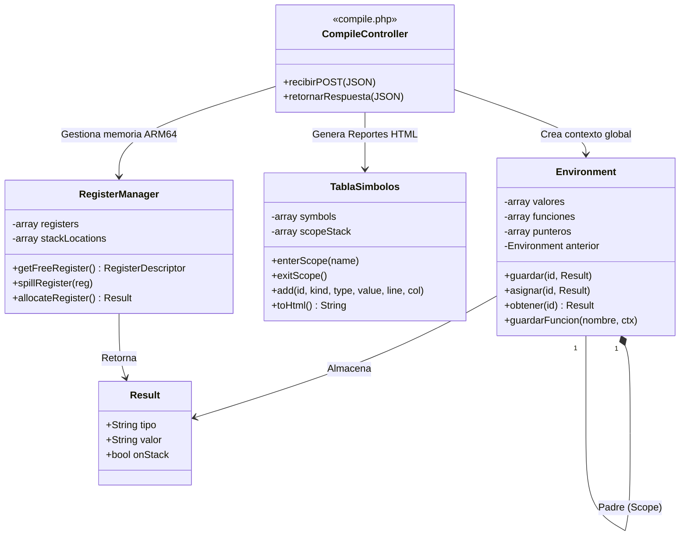
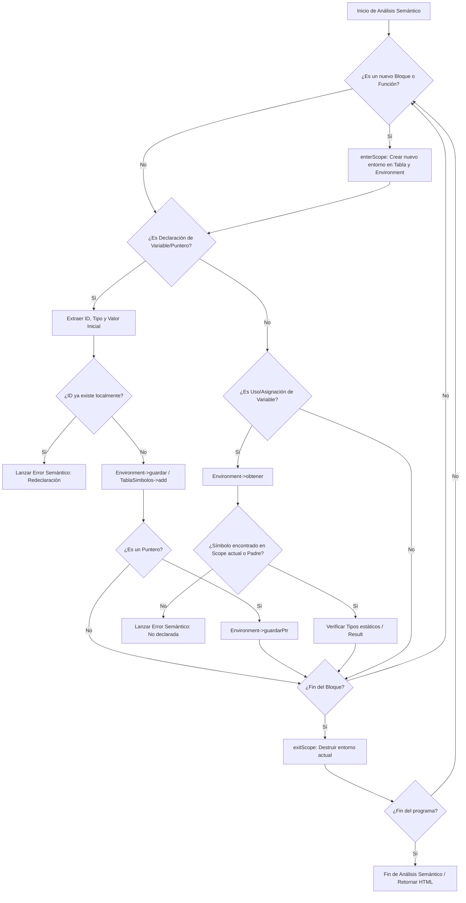

# Documentación Técnica: Compilador Golampi

## 1. Gramática Formal (EBNF)

El lenguaje Golampi fue diseñado utilizando ANTLR4 para la fase de análisis léxico y sintáctico. A continuación se presenta la gramática formal simplificada en notación EBNF basada en las reglas del analizador sintáctico:

**Estructura Principal:**
* `program` ::= `declaration`* `EOF`
* `declaration` ::= `varDecl` | `constDecl` | `functionDecl` | `statement`

**Tipos de Datos:**
* `type` ::= `*` `type` | `[` `expr` `]` `type` | `int32` | `float32` | `string` | `bool` | `rune`

**Declaraciones y Variables:**
* `varDecl` ::= `var` `idList` `type` (`=` `exprList`)? `;`?
* `shortVarDecl` ::= `idList` `:=` `exprList` `;`?
* `constDecl` ::= `const` `ID` `type` `=` `expr` `;`?
* `idList` ::= `ID` (`,` `ID`)*

**Funciones:**
* `functionDecl` ::= `func` `ID` `(` `parameters`? `)` `returnType`? `block`
* `parameters` ::= `parameter` (`,` `parameter`)*
* `returnType` ::= `type` | `(` `type` (`,` `type`)* `)`

**Sentencias de Control y Flujo:**
* `statement` ::= `varDecl` | `constDecl` | `shortVarDecl` | `Assignment` | `IfStatement` | `SwitchStmt` | `ForStatement` | `TransferStmt` | `ExprStmt`
* `IfStatement` ::= `if` `expr` `block` (`else` (`ifStmt` | `block`))?
* `ForStatement` ::= `for` (`initStmt`; `expr`; `postStmt`) `block` | `for` `expr` `block` | `for` `block`
* `TransferStmt` ::= `break` | `continue` | `return` `exprList`?

**Expresiones Base:**
* `expr` ::= `ArrayLiteral` | `IndexAccess` | `FuncCall` | `AddressOf` | `Dereference` | `Not` | `MulDivMod` | `AddSub` | `Relational` | `Equality` | `Logical` | `Literal` | `FMT_PRINTLN`

## 2. Diagrama de Clases (Arquitectura del Compilador Backend)

La arquitectura del compilador está implementada en **PHP 8+** y funciona como una API. Utiliza el patrón Visitor para recorrer el AST generado por ANTLR4, y cuenta con gestores especializados para el entorno (scopes), la generación de código ARM64 y el manejo de errores.

## 3. Diagrama de Flujo de la Tabla de Símbolos y Entornos

El siguiente diagrama detalla cómo la clase `Environment` y `TablaSimbolos` gestionan la memoria lógica, el *hoisting* de funciones y la resolución de punteros durante el recorrido semántico.

   