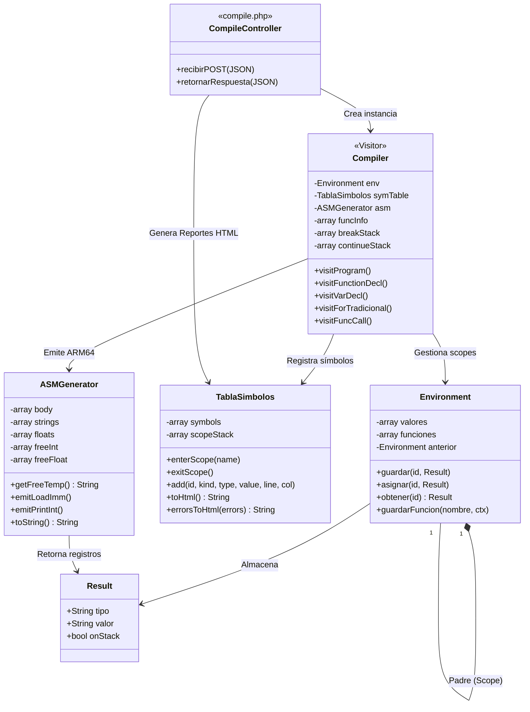
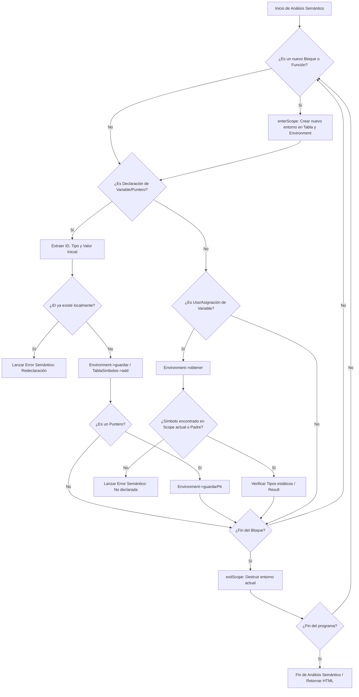

# Documentación Técnica: Compilador Golampi

## 1. Gramática Formal (EBNF)

El lenguaje Golampi fue diseñado utilizando ANTLR4 para la fase de análisis léxico y sintáctico. A continuación se presenta la gramática formal simplificada en notación EBNF basada en las reglas del analizador sintáctico:

**Estructura Principal:**

* `program` ::= `declaration`* `EOF`
* `declaration` ::= `varDecl` | `constDecl` | `functionDecl` | `statement`

**Tipos de Datos:**

* `type` ::= `*` `type` | `[` `expr` `]` `type` | `int32` | `float32` | `string` | `bool` | `rune`

**Declaraciones y Variables:**

* `varDecl` ::= `var` `idList` `type` (`=` `exprList`)? `;`?
* `shortVarDecl` ::= `idList` `:=` `exprList` `;`?
* `constDecl` ::= `const` `ID` `type` `=` `expr` `;`?
* `idList` ::= `ID` (`,` `ID`)*

**Funciones:**

* `functionDecl` ::= `func` `ID` `(` `parameters`? `)` `returnType`? `block`
* `parameters` ::= `parameter` (`,` `parameter`)*
* `returnType` ::= `type` | `(` `type` (`,` `type`)* `)`

**Sentencias de Control y Flujo:**

* `statement` ::= `varDecl` | `constDecl` | `shortVarDecl` | `Assignment` | `IfStatement` | `SwitchStmt` | `ForStatement` | `TransferStmt` | `ExprStmt`
* `IfStatement` ::= `if` `expr` `block` (`else` (`ifStmt` | `block`))?
* `ForStatement` ::= `for` (`initStmt`; `expr`; `postStmt`) `block` | `for` `expr` `block` | `for` `block`
* `TransferStmt` ::= `break` | `continue` | `return` `exprList`?

**Expresiones Base:**

* `expr` ::= `ArrayLiteral` | `IndexAccess` | `FuncCall` | `AddressOf` | `Dereference` | `Not` | `MulDivMod` | `AddSub` | `Relational` | `Equality` | `Logical` | `Literal` | `FMT_PRINTLN`

**Tokens léxicos:**

* `INT` ::= `[0-9]+`
* `FLOAT` ::= `[0-9]+ '.' [0-9]+`
* `STRING` ::= `'"' (~["\r\n\\] | '\\' .)* '"'`
* `CHAR` ::= `'\'' . '\''`
* `ID` ::= `[a-zA-Z_][a-zA-Z0-9_]*`
* `FMT_PRINTLN` ::= `'fmt.Println'`
* `WS`, `COMMENT (//)`, `BLOCK_COMMENT (/* */)` → ignorados

## 2. Diagrama de Clases (Arquitectura del Compilador Backend)

La arquitectura del compilador está implementada en **PHP 8+** y funciona como una API. Utiliza el patrón Visitor para recorrer el AST generado por ANTLR4, y cuenta con gestores especializados para el entorno (scopes), la generación de código ARM64 y el manejo de errores.



## 3. Diagrama de Flujo de la Tabla de Símbolos y Entornos

El siguiente diagrama detalla cómo la clase `Environment` y `TablaSimbolos` gestionan la memoria lógica, el *hoisting* de funciones y la resolución de punteros durante el recorrido semántico.



## 4. Generación de Código ARM64 (AArch64)

El compilador genera código ensamblador ARM64 ejecutable mediante QEMU. La clase `ASMGenerator` administra los registros temporales, las constantes en `.data` y las rutinas de soporte.

### 4.1. Estructura del archivo `.s` generado

```asm
.section .data
__newline:    .byte 10
__space:      .byte 32
__minus:      .byte 45
__buf:        .skip 32
__now_buf:    .skip 32
__substr_buf: .skip 256

str_0:     .asciz "Hola"
str_0_len: .quad 4

.section .text
.align 2
.global _start

; Rutinas de soporte
__print_int:    ...
__print_char:   ...
__print_float:  ...
__strlen:       ...
__substr:       ...
__now:          ...
__format_epoch: ...

_start:
    ; === main ===
    ...
    mov x0, #0
    mov x8, #93   ; syscall exit
    svc #0

; Funciones de usuario
suma:
    stp x29, x30, [sp, #-16]!
    mov x29, sp
    ...
    ldp x29, x30, [sp], #16
    ret
```

### 4.2. Convención de llamadas AArch64

| Registro | Uso |
|---|---|
| `x0` – `x7` | Parámetros de función y valores de retorno (hasta 4 retornos múltiples) |
| `x8` | Número de syscall |
| `x9` – `x15` | Temporales del compilador (caller-saved) |
| `x19` – `x28` | Registros preservados por función (callee-saved) |
| `x29` | Frame Pointer |
| `x30` | Link Register (dirección de retorno) |
| `sp` | Stack Pointer |

### 4.3. Patrones de generación

**if/else:**

```asm
    cbz  cond, else_L0
    ; bloque then
    b    end_if_L1
else_L0:
    ; bloque else
end_if_L1:
```

**for tradicional:** El `continue` salta a `for_post` (no a la condición), de modo que el postStmt se ejecute siempre antes de re-evaluar la condición.

```asm
    ; init
    b    for_cond_L2
for_body_L1:
    ; cuerpo
for_post_L3:
    ; postStmt (i++)
for_cond_L2:
    cbnz cond, for_body_L1
for_end_L4:
```

**switch/case:** Se emite una cadena de comparaciones consecutivas. Los `case` con múltiples valores generan un `b.eq` por cada valor.

```asm
    cmp  swReg, caseVal0
    b.eq sw_body_0
    cmp  swReg, caseVal1
    b.eq sw_body_1
    b    sw_default
sw_body_0: ... b sw_end
sw_body_1: ... b sw_end
sw_default: ...
sw_end:
```

**Función de usuario:**

```asm
nombre_func:
    stp  x29, x30, [sp, #-16]!
    mov  x29, sp
    mov  x9, x0           ; param a → temporal
    mov  x10, x1          ; param b → temporal
    ; cuerpo
__ret_nombre_func:
    ldp  x29, x30, [sp], #16
    ret
```

**Cortocircuito de `&&` y `||`:** se implementa con saltos condicionales (`cbz`/`cbnz`) hacia etiquetas que evitan evaluar el operando derecho cuando el resultado ya está determinado.

### 4.4. Arreglos multidimensionales

Los arreglos se almacenan en el stack en layout **row-major** (estilo C). Para acceder a `cubo[k][i][j]` en `[2][2][2]int32`, el compilador calcula los strides:

* Primer índice (`k`): stride = `2 × 2 × 8 = 32 bytes`
* Segundo índice (`i`): stride = `2 × 8 = 16 bytes`
* Tercer índice (`j`): stride = `8 bytes`

La función `parseArrayType` extrae las dimensiones del tipo declarado, y `emitArrayInit` desempaca recursivamente literales anidados como `{{1,3},{5,7}}` colocando cada valor en el offset correcto.

### 4.5. Funciones embebidas

| Función | Implementación ARM64 |
|---|---|
| `fmt.Println` | Llama a `__print_int`, `__print_float`, `__print_char` o `write` (syscall 64) según el tipo |
| `len()` | Para strings: rutina `__strlen` que recorre hasta el null-terminator. Para arreglos: tamaño parseado del tipo declarado |
| `typeOf()` | Devuelve etiqueta de string literal con el nombre del tipo |
| `substr()` | Rutina `__substr` que copia `len` bytes desde `ptr+inicio` a `__substr_buf` |
| `now()` | Rutina `__now` que llama a `clock_gettime` (syscall 113) y `__format_epoch` formatea como `YYYY-MM-DD HH:MM:SS` |

## 5. Tecnologías Utilizadas

| Tecnología | Versión | Uso |
|---|---|---|
| PHP | ≥ 8.0 | Lenguaje del backend (Visitor + ASMGenerator) |
| ANTLRv4 | 4.13.1 | Generación del lexer y parser |
| antlr4-php-runtime | 0.9.1 | Runtime de ANTLR para PHP |
| HTML5 + CSS3 + JS | — | Interfaz gráfica de usuario |
| Composer | — | Gestión de dependencias PHP |
| QEMU | `qemu-aarch64` | Emulación ARM64 para ejecutar el `.s` generado |
| GNU `as` / `ld` | `aarch64-linux-gnu-*` | Ensamblador y linker para producir el binario |