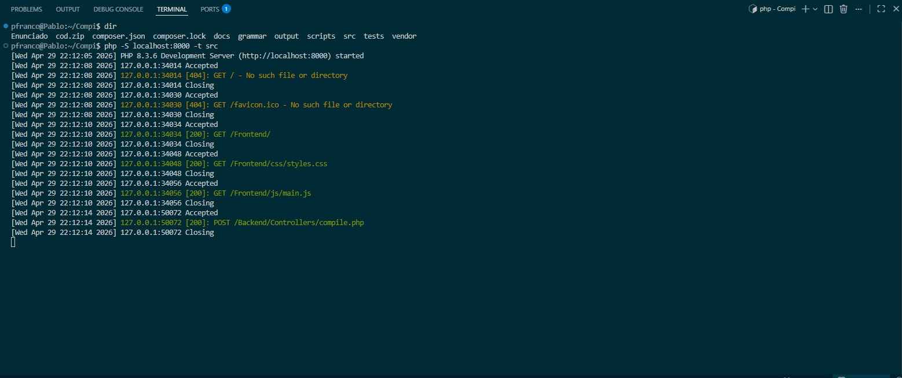
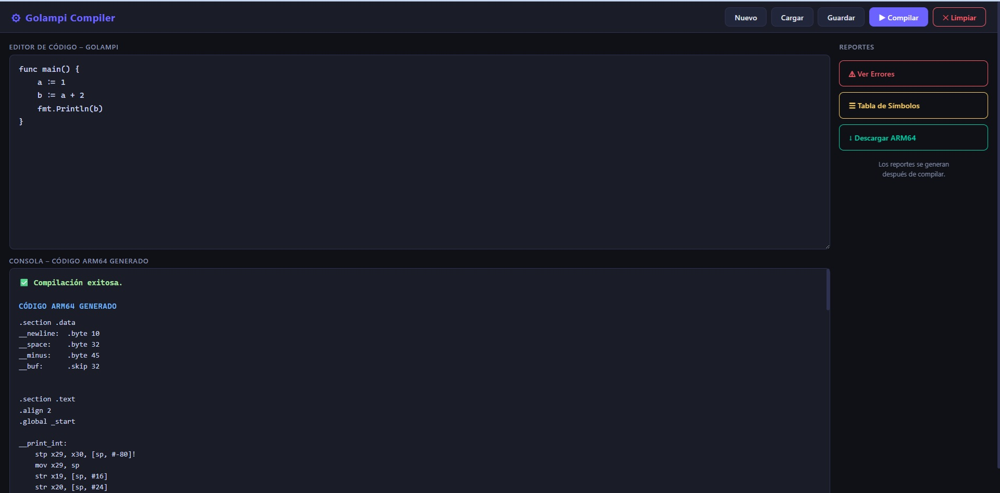
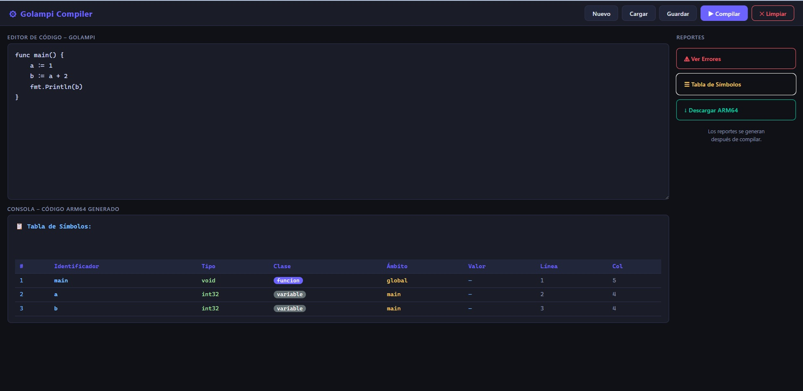

# Manual de Usuario: Lenguaje Golampi

Bienvenido a Golampi, un lenguaje de programación tipado estáticamente con una sintaxis moderna. Esta herramienta funciona a través de un compilador backend basado en PHP que procesa el código fuente y genera lenguaje ensamblador **ARM64**, además de reportes detallados en HTML.

## 1. Requisitos Previos

Para instalar y ejecutar el entorno de Golampi en tu máquina local, necesitas:

* PHP 8.0 o superior (requerido para los tipos estrictos y las propiedades tipadas).

* Composer (para gestionar las dependencias de ANTLR4 en PHP).

* Un entorno de servidor local (puede ser el servidor integrado de PHP, XAMPP, o Docker).

## 2. Instalación del Entorno

Sigue estos pasos paso a paso para levantar el compilador de Golampi en tu computadora:

* Paso 1: Clonar el repositorio y abrir la terminal\*\*

Ubícate en la carpeta raíz del proyecto (`COMPI [WSL: UBUNTU]`).

* Paso 2: Instalar las dependencias\*\*

Ejecuta Composer para instalar el runtime de ANTLR4 para PHP y generar el `autoload`:

``` bash
composer install
```

**Paso 3: Levantar el servidor backend** Inicia el servidor local de PHP apuntando a la carpeta de tu proyecto. Por ejemplo:
``` Bash
php -S localhost:8000
``` 
 

**3. Uso de la Herramienta**

El compilador interactúa mediante peticiones HTTP. Expone un endpoint en compile.php que recibe el código fuente en formato JSON y devuelve el Ensamblador ARM64, la Tabla de Símbolos y los reportes de Errores.

**3.1. Enviar código a compilar**

Puedes comunicarte con el compilador enviando una petición POST a <http://localhost:8000/src/compile.php> (ajusta la ruta según tu estructura exacta).

El formato de envío debe ser JSON:

```json

{

"codigo": "func main() { var x int32 = 10; fmt.Println(x); }"

}
```
**3.2. Respuesta del Servidor**

El compilador te devolverá una respuesta JSON estructurada con la siguiente información:

- **status**: Indica si fue exitoso (success) o si hubo fallos (error).
- **asm**: El código ensamblador ARM64 generado listo para usarse.
- **symTable**: El reporte de la Tabla de Símbolos renderizado en formato HTML.
- **errorsHtml**: El reporte detallado de errores léxicos, sintácticos o semánticos en HTML.

 

**4\. Ejemplos Prácticos en Golampi**

A continuación, se presentan ejemplos de código fuente válido que puedes enviar al compilador:

**Ejemplo 1: Declaración de variables y punteros**
```go

func main() {

var edad *int32 = 29;

var puntero int32 = &edad;

fmt.Println(edad);

fmt.Println(puntero);

}
```
**Ejemplo 2: Control de flujo (If y For)**
```go

func main() {

var limite int32 = 5;

// Ciclo for tradicional

for i := 0; i < limite; i++ {

if i % 2 == 0 {

fmt.Println("Es par");

} else {

fmt.Println("Es impar");

}

}

}
```

